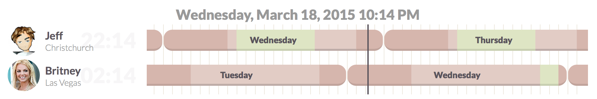

# Team Time

Team Time is an application inspired by [timezone.io](http://timezone.io) and [everytimezone.com](http://everytimezone.com) to allow you to see not only what time it is for your co-workers, but also their availability.

Not everyone works 9-5, Monday-Friday, so while knowing their local time is helpful, I wanted to also know if a team mate was even working that day.



## Setup

Clone this repository and either add a `people.json` to the root, or set up a MongoDB instance. If using the `people.json` use the following format:

``` json
[
  {
    "name": "Jeff",
    "avatar": "https://example.com/my-avatar.jpg",
    "city": "Christchurch",
    "tz": "Pacific/Auckland",
    "availability": {
      "monday": { "start": 8, "duration": 8.5 }
      "tuesday": { "start": 8, "duration": 8.5 }
      "wednesday": { "start": 8, "duration": 8.5 }
      "thursday": { "start": 8, "duration": 8.5 }
      "friday": { "start": 8, "duration": 8.5 }
    }
  }
]
```

## Deploy

This app is designed to deploy to Heroku. For now I've included the built js/css in the repo, so you can simply add your `people.json`, commit and push to Heroku.

```
heroku create
git push heroku master
```

## Development

This is a Node app, so you'll need [NodeJS](https://nodejs.org). I've included Browserify etc in the dev dependencies, so you should be able to:

```
npm install
npm run build
```

Optionally, I've also included a Makefile and watch script with LiveReload.

```
./configure
make
```

And to run the app:

```
npm start
```

Or, again if you're using Make, I've added a watch script with Livereload. *Requires [fswatch](https://github.com/emcrisostomo/fswatch)*

```
./watch
```
